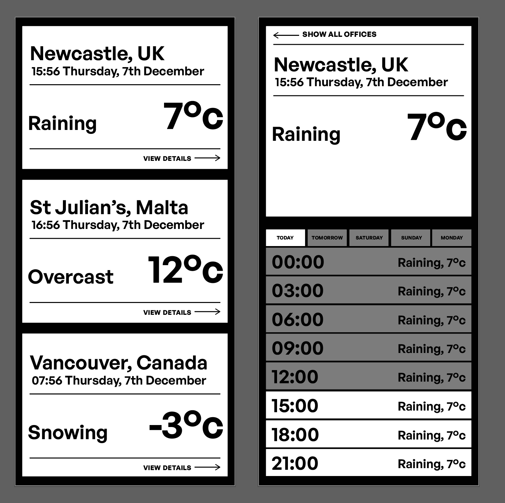

# Strive Weather

## Overview

Web application that displays the weather for the three Strive offices, making 
use of the OpenWeatherMap API (API key + office locations provided in test).

## Things I have ignored due to time constraints

- Best practices re dev/deployment and reproducible environments (it works on
  my machine).
- CI & deployment of the application. I had aimed to set up GH actions, but
  didn't have the time.
- I18n. I would normally want this set up first, even if it were just English.
- Related to previous: time zone handling, in particular the fact that I'm not
  taking into account *where* a user is viewing the site. This doesn't matter 
  for the current weather, but it does for forecasts. No time for time.
- A11y. I would want dev-side testing in place and running on my machine at 
  minimum.


## Setup Notes

These are required (older versions might work, can't at all guarantee it):

| Tool   | Version | Note                                      |
| ------ | ------- | ----------------------------------------- |
| Ruby   | 3.2.2   |                                           |
| SQLite | 3.44.2  |                                           |
| Rails  | 7.1.2   | Just for the CLI, may not be needed, ymmv |

For the task, a key has been provided for the [Open Weather Map](openweathermap.org/)
API. Note that this is for the free tier, which provides access to:

1. [the current weather at a location](https://openweathermap.org/current), and
2. [a 5-day forecast](https://openweathermap.org/forecast5) (which provides the forecast in 3-hour intervals).

The key has been encoded as a credential, it is not an environment variable.

---

To set up and run the application, assuming the specified Ruby version is 
installed, `cd` into this project directory, and run:

```
gem install
```

Once installed, seed the database:

```
rails db:seed
```

Then start:

```
rails server
```

This should start a rails server at http://127.0.0.1:3000

## Initial steps

- [x] Initialise basic minimal Rails install.
- [x] Add Open Weather Map API key to the Rails user config secrets.
- [x] Add simple functional sketch of service object that hits Open Weather Map API.
- [x] Dump the data into the app:
    - [x] Add a route (`weathertest`)
    - [x] Add a controller that calls the OWM API & grabs data.
    - [x] Add a view that displays that data on an HTML page.

### Notes: Rails setup

Note that this is a minimal install (`rails new strive_weather --minimal`) which
strips out a large chunk of gems that have no relevance here (mailer, websockets, &c).


### Notes: Credentials

The OpenWeatherMap API key is stored in the standard Rails credentials file.

---

_I don't think this is something that existed last time I touched Rails, so the
following is a note for myself._

To *edit* the credentials file (where `EDITOR` is editor of choice):

```
EDITOR=vim rails credentials:edit
```

This will decrypt the file, and the api key data is defined like so:
 
```yml
open_weather_map:
  api_key: 'supersecretkey'
```

To *use* the value:

```
Rails.application.credentials.open_weather_map[:api_key]
```

---

> **NOTE** It would probably be sensible to check for the key on server
> initialisation, and explode immediately if it isn't found. It would probably
> also be sensible to provide a, say, `Settings` or `AppSettings` or whatever
> service that provides the value to the rest of the application, rather than
> referencing directly in the business logic.
>
> But given there's only one secret value I need here, just going to grab 
> it directly in-app.


### Notes: service object sketch

From reading up on HTTP clients, the _de facto_ standard seems to be
[Faraday](https://lostisland.github.io/faraday/), which fixes some problems
with the stdlib's `Net::HTTP`, and doesn't have some of the issues
[HTTParty](https://github.com/jnunemaker/httparty) (the previous _de facto_
standard client) has.

So the `OpenWeatherMapService` class leverages Faraday.

It includes explicit methods for hitting both the endpoint specified
in the test and the `forecast` API, I'll get back to why later on.

It does not error: both methods return an object specifying the response code
and either `:data` or an `:err` field that holds an error message. There is
also a `:url` field for debugging purposes.

---

To test in console (`rails console`), example commands:

```
require './app/services/open_weather_map_service.rb'
owm = OpenWeatherMapService.new()
lat = 54.971250
lon = -1.614590
owm.current_weather_for(lat, lon)
```

---

For app purposes, ther is a route (`weather_api`), a controller
(`weather_api_controller`) with an `index` method, and an associated view. This
prints out the current weather for the three offices.


### Finally

This fulfils the basics of the task. There are no tests or visual styling, and 
what is printed is a raw JSON response. But is does show the current weather
at all three locations.


## Offices


The application shows weather for offices. So the offices are the thing that is
to be displayed - the weather [forecast] is just a data associated with an office.

The root of the application is the index of offices. Then each office can be
viewed individually.

- [x] Routes:
    - [x] `offices`: an index page of offices.
    - [x] `offices/:id`: a specific office.
- [x] Root path ("/") to match "offices", then for specific offices "/:id"
- [x] Controller for offices, with `index` and `show` methods.
- [x] Views for `index` and `show` methods.
- [ ] Error views.
- [x] Data structure for offices.
- [x] Dummy a populated offices database table using a YAML file representing
      the office data structure.
- [x] Add an initializer that provides an `OFFICES` global variable, referencing
      the data in the YAML file, ensuring it atomises the keys to match how
      the actual data will be made available once model written & Db populated.
- [ ] Ensure views link together on FE:
    - [x] link for each office in index > show page for that office.
    - [x] link on show > go back to index.
    - [ ] Correct links on error pages that link back to the index page.
- [ ] Add basic controller tests to explain the structuring.
- [x] Dummy current weather summary on office views.
- [x] Dummy weather forecast last updated time in views.
- [x] Initial sketch of CSS for site at this point (content is now extant).
- [x] Component for tabbed interface on show page showing forecast.
- [ ] Component for live office time as user view page.
- [ ] Time Zone information for each office in views
- [x] Model for offices.
- [x] Migration for offices.
    - [x] Seeds for offices (identical to the dummy data).
- [x] Replace calls to the dummied YAML-based data with calls to the actual data 
      from the model.
- [x] Delete the YAML data file + its initialiser.

### Notes: routing

The only routes that are important here are:

1. `GET "/offices`", which is a index page resource that displays information 
   on all offices, using `offices#index`, and 
2. `GET "/offices/:id"`, which shows more detailed data for a single office,
   using `offices#show`.

This is, however, a very small app, so I've set the `root` (i.e. `"/"`) to be
the index page, and then `"/:id"` (rather than `"offices/:id"` shows the detailed
data.

This is extremely contrictive and not scalable, but it's relatively easy to 
change the logic in the router were the scope to widen in a real application.


### Notes: data

The data for each office is going to be stored in the database. I don't need to
store much. 

It would be perfectly reasonable to store it as a flat file, but it's a little
more flexible if it's in the database. And I'm using a database Anyway, so I
might as well leverage it. As an initial sketch:

```
Table office {
  id           text [pk]
  municipality text
  country      text
  lat          real
  lon          real
}
```

Can be a city (Vancouver, Newcastle), or a town (St Julian's), hence `municipality`

The `country` & `municipality` columns are populated with (English) human text,
In actual app, they would just be codes, making translation much easier, but that
is outside the scope & time constraints of the task.


### Notes: dummying data for development

Before populating an actual database, useful to be able to get content onto the
page. So to do this, I load in a YAML file with data & provide a global variable
(`OFFICES`) via an initializer. This can then be used in the controllers and then
in the views for quick development before anything concrete goes in.


### Design sketch



### Notes: model conventions vs. initial idea of data modelled in SQL

Rails expects an `id` field. Things like the fancy view helpers helpers don't
work ootb without that ID.

The ID is just the autoincrementing `rowid`, it's meaningless. Using a specified*, 
meaningful ID is slightly fiddly to set up. It should be that, but time constraints
mean I'll just rely on the default for now, but that changes how I think about 
the data.

Initially, I'd wanted to use a readable string to identify the offices. Still think
this needs to be done. To reference weather data, I initially wanted to use a
compound primary key of `(lat, lon, timestamp)`. Still think this is the best
approach, but Rails will actively get in the way of this.


## Weather

1. There are three offices.
2. The open weather map *free* tier shows current weather + forecast for next 
   four days *including today* in three-hour intervals.
3. The open weather map API has a rate limit of 1000 req/day.
3. If the weather displayed is not completely correct at the time it is viewed,
   that's expected by users and is not a problem.
4. Therefor it is not essential that the current weather for a locality be pulled
   from the open weather map API on every user request.
5. Instead, run a query for each office against the *forecast* endpoint when the
   application first boots, then every three hours after that.
6. Regardless of how many users the application has, the application will make
   24 API requests to Open Weather Map a day.

- [x] Fixture for API response to request for forecast data.
- [ ] Model for Weather
- [ ] On application boot, make request to *forecast* API for each location.
- [ ] Add cron functionality to rerun request at three hour intervals.
- [ ] Intervals should be 00:00, 03:00, 06:00, 09:00, 12:00, 15:00, 18:00, 21:00
- [ ] The job should clear any records with a timestamp > 24 hours to current time.
- [ ] Add model call in offices controller to grab forecast.
- [ ] Replace dummied data with actual weather data.


